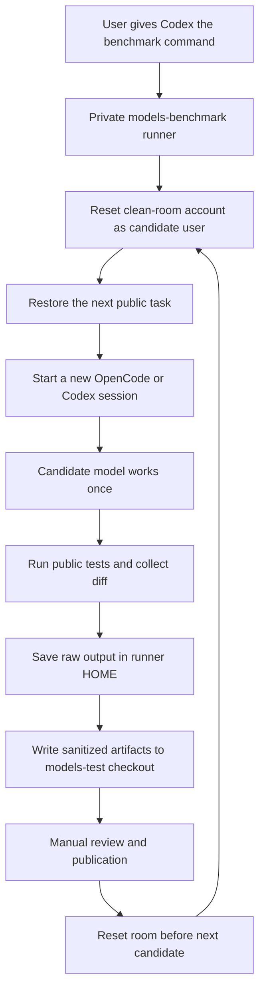

# Models Benchmark

Private benchmark runner for comparing coding models and agent runtimes on the
same real software tasks. Every model gets one clean starting point, one new
agent session, the same public documentation and tests, and one chance to
produce a solution. The runner preserves the resulting patch, public test
evidence, elapsed time, and independent model reviews as structured data.

The benchmark answers a practical question: given the same task and normal
coding-agent tools, what did each model actually deliver? It keeps code quality
separate from availability, provider failures, and infrastructure problems.
Public tasks and reviewed results live in `models-test`; this private repository
contains the orchestration needed to make the comparison fair.

## Table of Contents

- [Quick Start](#quick-start)
- [Current Status](#current-status)
- [Design Goals](#design-goals)
- [Documentation](#documentation)
- [What Is Tested](#what-is-tested)
- [Roles](#roles)
- [How The Pilot Works](#how-the-pilot-works)
- [What Keeps A Run Fair](#what-keeps-a-run-fair)
- [Repository Boundaries](#repository-boundaries)
- [Outcome Rules](#outcome-rules)
- [Pilot Commands](#pilot-commands)
- [Sandbox Verification](#sandbox-verification)
- [Integrity and Reproducibility](#integrity-and-reproducibility)
- [Result Layout](#result-layout)
- [Publication Sequence](#publication-sequence)
- [Pilot Limits](#pilot-limits)
- [Clean-Room Guarantee](#clean-room-guarantee)

## Quick Start

```bash
# 1. Clone repositories
git clone git@github.com:pickleshell/models-benchmark.git
git clone git@github.com:pickleshell/models-test.git

# 2. Install dependencies (runner account)
cd models-benchmark && npm install

# 3. Set up clean-room account (requires sudo)
sudo useradd --create-home --shell /bin/bash test
sudo -u test -H bash -lc 'curl -fsSL https://opencode.ai/install | bash'

# 4. Verify sandbox isolation
npm run verify:sandbox

# 5. Dry-run the pilot matrix
npm run pilot:dry-run

# 6. Run actual pilot (consumes model quota)
npm run pilot

# 7. Generate aggregate report
npm run aggregate -- <release-id>
```

## Current Status

The clean-room runner, isolated blind-judging workflow, and sanitized result
format are implemented. `pilot-2-tasks-r4` was an operational diagnostic run:
it found unavailable candidate and judge models and is not a publishable model
comparison. The next immutable run is `pilot-2-tasks-r5`.

The clean-room boundary is verified on the benchmark host with
`npm run verify:sandbox`. This non-model smoke check starts two real transient
systemd units and confirms that private shared memory is absent from both the
host and the next unit, that the units use distinct IPC namespaces, and that
the read-only OpenCode runtime can still start inside the same sandbox. It also
records the relevant same-UID process limitation described below. The check
uses no model quota and creates no benchmark release.
It acquires the same host-wide clean-room lock as a pilot and requires the
`test` account to be idle, so it cannot overlap a benchmark run.
Its temporary same-UID sentinel is terminated and confirmed absent before that
lock is released; a cleanup failure leaves a marked stale lock for operator
recovery.

The initial OpenCode version preflight is intentionally narrower than a model
run: it receives only the read-only runtime and private sandbox storage, never
the clean workspace or persistent agent home. A failed version check therefore
cannot leave candidate state behind.

The project remains in pilot validation. Two tasks and one run per model are
useful evidence, not a definitive general ranking.

The current pilot configuration is data-driven: candidate models, judges,
tasks, criteria, subscription labels, and release ID live in
[`config/pilot.json`](config/pilot.json). Their counts can change in later
releases without changing the runner's core workflow.

### Next Pilot Matrix

Release `pilot-2-tasks-r5` contains two tasks, three candidate models, and two
independent judges. Candidate models are invoked through OpenCode with the
subscription label `free`; the two free judge models are also invoked through
OpenCode:

| Role | ID | Model |
| --- | --- | --- |
| Candidate | `big-pickle` | `opencode/big-pickle` |
| Candidate | `deepseek-v4-flash-free` | `opencode/deepseek-v4-flash-free` |
| Candidate | `mimo-v2-5-free` | `opencode/mimo-v2.5-free` |
| Judge | `hy3-free` | `opencode/hy3-free` |
| Judge | `nemotron-3-5-lightning-free` | `opencode/nemotron-3.5-lightning-free` |

The task, candidate list, judge list, and criteria are release inputs, not
constants. Future releases may add tasks, models, judges, subscription tiers,
or a Codex candidate runtime.

The current tasks are `feature-implementation` and `refactoring`. The former
adds a feature-flag resolution behavior; the latter removes duplicated event
filtering while preserving the public API and malformed-input behavior.

## Pilot Configuration (`config/pilot.json`)

The pilot manifest is the single source of truth for a benchmark release.
All models, tasks, judges, criteria, and environment paths are declared here.

### Top-Level Fields

| Field | Type | Required | Description |
|-------|------|----------|-------------|
| `schema_version` | integer | yes | Manifest schema version (currently `1`) |
| `release` | string | yes | Immutable release identifier (e.g., `pilot-2-tasks-r5`) |
| `models_test` | string | yes | Absolute path to `models-test` checkout |
| `results_dir` | string | yes | Relative path under `models_test` for sanitized artifacts |
| `private_artifacts_dir` | string | yes | Runner-owned directory for raw logs (expands `~`) |
| `artifact_schemas` | object | yes | Schema version registry for all artifact types |
| `clean_room` | object | yes | Clean-room account and path configuration |
| `tasks` | array | yes | Task definitions (see below) |
| `candidates` | array | yes | Candidate model configurations |
| `judges` | array | yes | Judge model configurations |
| `criteria` | array | yes | Rubric criterion identifiers |

### `artifact_schemas`

Maps each artifact type to its schema version. The runner validates on
write and read. Changing a version requires a migration plan.

```json
"artifact_schemas": {
  "run": 1,
  "judge": 1,
  "preflight": 1,
  "aggregate": 2,
  "test_result": 1,
  "candidate_diff": 1
}
```

### `clean_room`

| Field | Type | Required | Description |
|-------|------|----------|-------------|
| `user` | string | yes | Clean-room account name (e.g., `test`) |
| `home` | string | yes | Clean-room home directory (expands `~`) |
| `opencode_root` | string | yes | Read-only OpenCode installation path |
| `lock_path` | string | yes | Host-wide lock directory (expands `~`) |
| `reset_script` | string | yes | Path to reset script inside clean-room home |
| `workspace` | string | yes | Candidate workspace path (inside `home`) |
| `agent_home` | string | yes | Fresh agent home per candidate (inside `home`) |

### `tasks` (array of objects)

| Field | Type | Required | Description |
|-------|------|----------|-------------|
| `id` | string | yes | Unique task identifier |
| `fixture` | string | yes | Relative path under `models_test` to task fixture |
| `prompt` | string | yes | Relative path under `models_test` to task prompt markdown |
| `test_command` | string[] | yes | Command to run public tests (e.g., `["npm", "test"]`) |
| `allowed_changes` | string[] | yes | Paths (relative to fixture) the candidate may modify |

**Change policy:** Any file changed outside `allowed_changes` triggers
`forbidden_changes` outcome; judges are skipped, no quality score assigned.

### `candidates` (array of objects)

| Field | Type | Required | Description |
|-------|------|----------|-------------|
| `id` | string | yes | Unique candidate identifier (used in artifact paths) |
| `agent` | string | yes | Agent runtime: `opencode` or `codex` |
| `runtime` | string | yes | Runtime identifier (currently `opencode`) |
| `model` | string | yes | Model identifier as known by the agent (e.g., `opencode/big-pickle`) |
| `subscription` | string | yes | Subscription tier label (e.g., `free`) |

### `judges` (array of objects)

| Field | Type | Required | Description |
|-------|------|----------|-------------|
| `id` | string | yes | Unique judge identifier |
| `agent` | string | yes | Agent runtime for judging |
| `provider` | string | yes | Provider identifier |
| `model` | string | yes | Judge model identifier |
| `subscription` | string | yes | Subscription tier label |

### `criteria` (array of strings)

Rubric criterion identifiers. Must match keys in judge score objects.
Current pilot uses four:

```json
"criteria": [
  "functional_correctness",
  "reliability_edge_cases",
  "maintainability_clarity",
  "scope_discipline"
]
```

Each judge scores every criterion 1–10. Aggregate averages across
valid judge responses per criterion, then computes overall mean.

## Design Goals

- identical tasks, prompts, and starting revisions for every candidate;
- isolated execution with no cross-run state or access to private orchestration;
- deterministic, machine-readable artifacts;
- separate model quality from provider availability and infrastructure errors;
- reproducible local runs and independently verifiable published reports;
- explicit versioning of tasks, rubrics, harnesses, models, and runner code.

## Documentation

- [Technical specification](docs/technical-spec.md)
- [Roadmap](docs/roadmap.md)
- [Deployment guide](docs/deployment.md)

The technical specification defines the broader benchmark contract; this README
describes the implemented pilot and how its evidence is stored.

## What Is Tested

This is a coding-agent benchmark, not a generic question-answering benchmark.
Each candidate receives the same public task fixture, task instructions,
documentation, starting Git baseline, and public tests. The current pilot runs
the public `feature-implementation` and `refactoring` tasks from `models-test`.

For every candidate/task pair, the pipeline records:

- whether the agent process completed, timed out, or failed;
- the resulting Git diff and changed-file list;
- the public test result and output;
- agent, test, and combined candidate-execution timings;
- each independent judge's scores, confidence, explanation, and concerns.

The current rubric has four dimensions: functional correctness, reliability
and edge cases, maintainability and clarity, and scope discipline. A passing
public test suite is evidence, not an automatic perfect score.

Judging is identity-blind. Each judge examines an anonymous isolated copy of the
submitted workspace, runs the public tests, and is asked to return structured
scores from 1 to 10 with confidence, explanation, and concerns. The judge
process receives no candidate ID, model, agent/runtime, provider, subscription,
candidate logs, private artifacts, or candidate-derived path. The workspace is
rebuilt from the trusted task baseline and the recorded candidate patch; the
candidate's `.git` directory is never copied, and the judge sandbox can write
only to that anonymous workspace and its fresh agent home. For a completed candidate,
the aggregate averages each criterion across valid judge responses. Its
`overall_average` is the arithmetic mean of all four criterion averages.
Invalid judge output is retained as evidence but excluded from score math;
missing evidence is never converted to zero.

Blind judging hides the declared candidate identity, but it cannot guarantee
that a judge will not infer a model from stylistic or other characteristics of
the submitted code.

## Roles

| Role | Responsibility | Current pilot |
| --- | --- | --- |
| Candidate | Performs the task once in the clean room | Three configured OpenCode models |
| Judge | Independently inspects the resulting workspace and runs public tests | HY3 Free and Nemotron 3.5 Lightning Free through OpenCode |
| Orchestrator | Starts/reset runs, captures evidence, and reports progress | Codex plus the private runner |

Candidates never see another candidate's workspace, patch, session history,
agent home, judge prompt, judge output, reference solution, runner artifacts,
or provider credentials. Judges receive an anonymous copy of one completed
submission and a fresh agent home of their own.

## How The Pilot Works

Codex acts as the visible orchestrator. It reads the private runner
configuration, starts the pilot, reports live progress, and stops on an
unexpected failure. Candidate models are executed one at a time in the clean
room through their configured OpenCode or Codex agent.



The next hardened pilot uses two public tasks and three models already present
in the published comparison. Each model receives one pass and one chance per
task. There is no retry and no reuse of a previous agent session.

Before creating a release, the runner also probes every required judge. If a
judge model is unavailable, the run stops before any candidate is given a task
and before any release directory is created. This prevents a costly candidate
matrix with no usable scoring evidence.

The pilot clean room is the dedicated Linux account `test`. Before every
candidate, the runner removes the previous workspace and agent state and
restores the public task from a trusted archive. Candidate commands then run
inside a new transient systemd sandbox. The sandbox exposes only that
candidate's workspace, a fresh agent home, the read-only agent runtime, and a
private disposable temporary filesystem. It cannot see the host home, host
temporary files, the runner's artifacts, or any previous candidate's workspace
or session history.

The clean room is also reset once after the complete configured matrix. This
means a candidate gets one attempt, a new agent session, and no files or
history from a previous candidate. A rerun is a new benchmark release, never a
retry hidden under the same result directory.

## What Keeps A Run Fair

The benchmark does not rely on models behaving politely. It makes the starting
point, execution environment, evidence, and review process explicit.

| Control | What it protects |
| --- | --- |
| Same public baseline | Every candidate receives the same fixture, instructions, documentation, and public tests. |
| One attempt | A candidate gets one new agent session per task. There is no retry or reuse of a previous session. |
| Clean-room reset | Before every candidate, the prior workspace and agent state are removed and the trusted task archive is restored. |
| Separate sandbox | Every candidate, test, and judge runs in a new systemd mount namespace, not in the host account's normal environment. |
| No cross-run files | A sandbox cannot see the host home, host temporary files, runner artifacts, or another model's workspace, session, or agent home. |
| Private temporary storage | A model may use temporary files during its own run, but that storage is private to its sandbox and disappears when the process ends. Another model cannot find it. |
| Private IPC and shared memory | SysV/POSIX IPC and `/dev/shm` are isolated per transient unit, so they cannot carry data from one candidate or judge to the next. |
| Host-process guard | `ProtectProc=invisible` hides processes owned by other users. Before a run, the runner also refuses to start while *any* `test`-owned process exists, because same-UID processes remain mutually visible. |
| Read-only runtime | The OpenCode installation is mounted read-only, so a candidate cannot alter the agent runtime used by later runs. |
| Limited writes | Candidate-controlled processes can write only their disposable workspace, fresh agent home, and private temporary storage. |
| Trusted comparison | The runner compares the final file tree with a trusted baseline, including untracked files and changes hidden by a candidate commit. |
| Change policy | Changes outside a task's `allowed_changes` are classified as `forbidden_changes` and never receive a quality score. |
| Private raw evidence | Raw model output and operational diagnostics stay in the runner account's private directory; only sanitized artifacts enter `models-test`. |
| Blind judging | Each judge receives a fresh anonymous workspace rebuilt from the trusted baseline plus one patch. It never receives candidate identity, logs, original workspace, or another judge's work. |
| Availability gate | Required judges are checked before a release exists; candidates are checked before receiving a task. Provider availability is never confused with code quality. |
| Single-run lock | A host-wide lock prevents two releases from resetting or using the same clean room at the same time. |
| Immutable releases | A release ID cannot be reused. A rerun always has a new identifier and cannot overwrite or mix prior evidence. |

In particular, a model cannot leave a solution in a shared temporary directory
for the next model to discover. The runner gives each transient sandbox its own
temporary filesystem. It is not the host temporary filesystem, is not shared
with another sandbox, and is discarded at teardown.

The sandbox retains outbound network access because OpenCode must reach its
model providers. This benchmark is designed to prevent accidental local state
carry-over and ordinary execution mistakes; it is not an adversarial-network
containment system for a model deliberately trying to publish data to an
external service. A proxy-based egress allowlist is a separate hardening stage.

The lock is deliberately fail-closed. If a runner is killed before cleanup, or
the final reset fails, the lock remains marked with the cleanup failure. The
next release stops rather than guessing that the room is safe. An operator must
inspect the lock owner, confirm that no benchmark process remains, restore the
clean room if necessary, and only then remove that exact stale lock. This is
preferable to risking a mixed run.

## Repository Boundaries

`models-benchmark` is private and contains the runner, manifests, reset
orchestration, judge configuration, and private raw artifacts. The task itself
and its public tests remain available in `models-test`.

The candidate account can read the published task and tests, but cannot read
runner-owned raw logs, judge prompts, reference solutions, credentials, or
other candidates' results. The runner writes only sanitized result files to
the `models-test` checkout. It never pushes them automatically.

## Outcome Rules

Code quality and operational availability are deliberately different facts.

| Outcome | Meaning | Judge scores |
| --- | --- | --- |
| `completed` | Candidate exited successfully and public tests were evaluated | Included when a judge returns valid structured scores |
| `tests_failed` | Candidate completed but public tests failed | Retained and may be judged |
| `agent_failure` | A started candidate process, timeout, or infrastructure step failed | Judges are skipped; aggregate score is `N/A` |
| `unavailable` | A harmless preflight request received no model response | Tasks are not started; judges are skipped and quality is `N/A` |
| `forbidden_changes` | Candidate changed a path outside the task's `allowed_changes` policy | Patch and test evidence are retained; judges are skipped |

Timeout is additionally recorded as `agent.timed_out: true` in `run.json`. An
unavailable provider must not become a zero-quality row or silently vanish from
a report. It remains visible as an availability result with `N/A` quality data.

## Pilot Commands

From the repository root, inspect the planned matrix first:

```sh
npm run pilot:dry-run
```

The real pilot is intentionally explicit:

```sh
npm run pilot
```

Progress is emitted as newline-delimited JSON. Results are prepared under the
configured `models-test` checkout for manual inspection and publication.

After a pilot, build the local summary without publishing it:

```sh
npm run aggregate -- pilot-1-task-r6
```

### Sandbox Verification

Verify the clean-room isolation boundaries without invoking any models:

```sh
npm run verify:sandbox
```

This starts two transient systemd units and confirms:
- Private `/dev/shm` marker from first unit is absent from host and second unit
- IPC namespace identifiers differ between units and host
- Each unit can create a SysV message queue
- Same-UID process visibility limitation is demonstrated
- Read-only OpenCode runtime starts inside the hardened boundary

The check acquires the same host-wide clean-room lock as a pilot and requires
the clean-room account to be idle. It uses no model quota and creates no
benchmark release.

## Integrity and Reproducibility

### Artifact Schema Versioning

All public artifacts carry explicit schema versions defined in
[`config/pilot.json`](config/pilot.json) under `artifact_schemas`:

| Artifact | Version |
|----------|---------|
| `run.json` | 1 |
| `judge/*.json` | 1 |
| `preflight.json` | 1 |
| `test-result.json` | 1 |
| `aggregate.json` | 2 |

The runner validates schema versions on write and read. Unknown or mismatched
versions produce explicit errors. Older published artifacts are never silently
rewritten.

### Artifact Integrity Hashes

Every published JSON artifact includes a canonical SHA-256 hash of its content
(excluding the hash field itself), enabling post-publication integrity verification:

- `run.json` → `artifact_hash`
- `preflight.json` → `artifact_hash`
- `test-result.json` → `artifact_hash`
- `judge/<id>.json` → `artifact_hash`
- Referenced files (`candidate.diff`, `test-result.json`) → `artifacts` object

Hashes are computed **before** writing and embedded in the artifact. The
canonical serialization excludes the hash field itself, so the published file
hash matches the recorded value.

### Judge Prompt Versioning

Judge prompts are versioned in [`config/judge-prompt.json`](config/judge-prompt.json).
Each judge result records:

- `judge_prompt_version` — template version from config
- `judge_prompt_hash` — SHA-256 of the **rendered** prompt sent to the judge

This ensures exact reproducibility of the judging input.

### Reproducibility Metadata

`aggregate.json` includes a `reproducibility` object with:

```json
{
  "runner_version": "from package.json",
  "repository_commit": "git rev-parse HEAD",
  "config_hash": "SHA-256 of pilot.json",
  "schema_registry": { "version": 1, "artifact_schemas": {...} },
  "effective_limits": { "timeout_ms": 900000, "max_output_bytes": 2097152 },
  "judge_prompt": { "version": 1, "template_hash": "..." },
  "outcomes": { "candidate-id": { "overall": "...", "tasks": [...] } }
}
```

No private paths, credentials, or raw provider output are included.

### Clean-Room Lock Recovery

The host-wide lock uses a fail-closed atomic protocol:

1. **Fast path**: `mkdir(lockPath)` succeeds → new lock acquired
2. **Existing lock**: Read `owner.json`, validate `pid` + `start_time`
3. **Live owner** (PID exists + start_time matches): refuse with error
4. **Stale owner** (dead PID or start_time mismatch): atomic `rename(lockPath, quarantinePath)` → only winner creates new lock
5. **Missing/invalid `owner.json`**: fail-closed, no auto-recovery

The `start_time` uses `getconf CLK_TCK` for portable clock-tick conversion,
preventing PID-reuse false positives. Malformed or missing owner metadata is
never auto-recovered; manual inspection is required.

The aggregate ignores judge scores for unavailable, failed, or policy-violating
candidates. They remain visible with an explicit outcome rather than receiving
a zero-quality score.

Each future `run.json` records `started_at`, `completed_at`, and `duration_ms`
for the candidate execution, agent phase, and public-test phase. Judge
artifacts record their execution duration too. Existing artifacts created
before this field was introduced intentionally remain without reconstructed
timing.

## Result Layout

The complete public release tree looks like this:

```text
<release>/
  aggregate.json
  aggregate.md
  <candidate>/
    preflight.json
    <task>/
      run.json
      candidate.diff
      test-result.json
      judges/<judge-id>.json
```

An unavailable candidate has a deliberately smaller artifact set:

```text
<candidate>/preflight.json
<candidate>/<task>/run.json
```

`preflight.json` records the safe availability result and timing. The skipped
task records contain `outcome: "unavailable"`; there is no patch, test output,
or judge result because the model never received the task. `aggregate.json` and
`aggregate.md` are written once at the release root, never inside a task.

The pipeline publishes data only. A separate site or reporting repository may
render it. `run.json` includes candidate, test, and overall execution timing;
`aggregate.json` preserves candidate, test, and judge duration data, including
per-judge timing inside each task entry and per-candidate totals by judge ID.
The generated Markdown aggregate has one timing column for each configured
judge. Reports must render
availability failures as `N/A`, not as zero-quality scores.

`run.json` records the benchmark release, task, agent, runtime, model,
subscription, execution status, changed files, and artifact locations. Raw
agent stdout/stderr remains under the private runner artifact directory.

### Public Artifact Fields

| File | Contents | Publication rule |
| --- | --- | --- |
| `<candidate>/preflight.json` | Availability-probe status, timing, **artifact_hash** | Sanitized and reviewable |
| `run.json` | Candidate identity, agent/runtime, statuses, timestamps, durations, changed files, **artifacts** (file hashes), **artifact_hash** | Sanitized and reviewable |
| `candidate.diff` | Final Git patch against the baseline | Sanitized and reviewable |
| `test-result.json` | Public test exit status, timing, stdout, stderr, **artifact_hash** | Sanitized and reviewable |
| `judges/<id>.json` | Judge identity, scores, confidence, explanation, concerns, timing, **judge_prompt_version**, **judge_prompt_hash**, **artifact_hash** | Sanitized and reviewable |
| `aggregate.json` / `aggregate.md` | Comparable rows, score averages, **reproducibility metadata** | Generated locally, manually reviewed |

### Artifact Examples

<details>
<summary><strong>run.json (completed candidate)</strong></summary>

```json
{
  "schema_version": 1,
  "release": "pilot-2-tasks-r5",
  "task": "feature-implementation",
  "candidate": {
    "id": "big-pickle",
    "agent": "opencode",
    "runtime": "opencode",
    "model": "opencode/big-pickle",
    "subscription": "free"
  },
  "started_at": "2026-01-15T10:30:00.000Z",
  "completed_at": "2026-01-15T10:35:42.123Z",
  "duration_ms": 342123,
  "agent": {
    "status": 0,
    "signal": null,
    "timed_out": false,
    "output_limited": false,
    "started_at": "2026-01-15T10:30:00.000Z",
    "completed_at": "2026-01-15T10:34:12.456Z",
    "duration_ms": 252456
  },
  "tests": {
    "status": 0,
    "timed_out": false,
    "output_limited": false,
    "started_at": "2026-01-15T10:34:12.456Z",
    "completed_at": "2026-01-15T10:35:42.123Z",
    "duration_ms": 89667
  },
  "outcome": "completed",
  "changed_files": ["fixtures/phase2/feature-implementation/src/featureFlags.js"],
  "forbidden_changes": [],
  "artifacts": {
    "public_dir": "results/benchmark-pilot/pilot-2-tasks-r5/big-pickle/feature-implementation",
    "candidate_diff": { "path": "candidate.diff", "sha256": "a1b2c3d4..." },
    "test_result": { "path": "test-result.json", "sha256": "e5f6g7h8..." }
  },
  "artifact_hash": { "path": "run.json", "sha256": "i9j0k1l2..." }
}
```

</details>

<details>
<summary><strong>run.json (unavailable candidate)</strong></summary>

```json
{
  "schema_version": 1,
  "release": "pilot-2-tasks-r5",
  "task": "feature-implementation",
  "candidate": {
    "id": "deepseek-v4-flash-free",
    "agent": "opencode",
    "runtime": "opencode",
    "model": "opencode/deepseek-v4-flash-free",
    "subscription": "free"
  },
  "started_at": "2026-01-15T11:00:00.000Z",
  "completed_at": "2026-01-15T11:00:00.000Z",
  "duration_ms": 0,
  "agent": null,
  "tests": null,
  "outcome": "unavailable",
  "availability": {
    "reason": "no_model_response",
    "preflight": "model_preflight",
    "started_at": "2026-01-15T10:59:45.123Z",
    "completed_at": "2026-01-15T10:59:55.456Z",
    "duration_ms": 10333
  },
  "changed_files": [],
  "forbidden_changes": [],
  "artifacts": { "public_dir": "results/benchmark-pilot/pilot-2-tasks-r5/deepseek-v4-flash-free/feature-implementation" },
  "artifact_hash": { "path": "run.json", "sha256": "m3n4o5p6..." }
}
```

</details>

<details>
<summary><strong>judge.json (completed)</strong></summary>

```json
{
  "schema_version": 1,
  "judge": {
    "id": "hy3-free",
    "agent": "opencode",
    "model": "opencode/hy3-free",
    "subscription": "free"
  },
  "status": "completed",
  "response": "{"scores":{"functional_correctness":9,"reliability_edge_cases":8,"maintainability_clarity":9,"scope_discipline":10},"confidence":0.92,"explanation":"All tests pass. Clean implementation with proper error handling.","concerns":[]}",
  "scores": {
    "functional_correctness": 9,
    "reliability_edge_cases": 8,
    "maintainability_clarity": 9,
    "scope_discipline": 10
  },
  "confidence": 0.92,
  "explanation": "All tests pass. Clean implementation with proper error handling.",
  "concerns": [],
  "execution": {
    "status": 0,
    "signal": null,
    "timed_out": false,
    "started_at": "2026-01-15T10:36:00.000Z",
    "completed_at": "2026-01-15T10:37:30.789Z",
    "duration_ms": 90789
  },
  "judge_prompt_version": 1,
  "judge_prompt_hash": "q7r8s9t0...",
  "candidate": "big-pickle",
  "task": "feature-implementation",
  "artifact_hash": { "path": "hy3-free.json", "sha256": "u1v2w3x4..." }
}
```

</details>

<details>
<summary><strong>judge.json (skipped \u2014 candidate outcome)</strong></summary>

```json
{
  "schema_version": 1,
  "judge": {
    "id": "hy3-free",
    "agent": "opencode",
    "model": "opencode/hy3-free",
    "subscription": "free"
  },
  "status": "skipped",
  "reason": "unavailable",
  "candidate": "deepseek-v4-flash-free",
  "task": "feature-implementation",
  "artifact_hash": { "path": "hy3-free.json", "sha256": "y5z6a7b8..." }
}
```

</details>

<details>
<summary><strong>aggregate.json</strong></summary>

```json
{
  "schema_version": 2,
  "release": "pilot-2-tasks-r5",
  "criteria": [
    "functional_correctness",
    "reliability_edge_cases",
    "maintainability_clarity",
    "scope_discipline"
  ],
  "candidates": [
    {
      "candidate": {
        "id": "big-pickle",
        "agent": "opencode",
        "runtime": "opencode",
        "model": "opencode/big-pickle",
        "subscription": "free"
      },
      "task_count": 2,
      "tasks": [
        {
          "task": "feature-implementation",
          "outcome": "completed",
          "agent": { "status": 0, "duration_ms": 252456 },
          "tests": { "status": 0, "duration_ms": 89667 },
          "duration_ms": 342123,
          "judge_count": 2,
          "judge_invocation_count": 2,
          "judge_durations": [
            { "id": "hy3-free", "status": "completed", "duration_ms": 90789 },
            { "id": "nemotron-3-5-lightning-free", "status": "completed", "duration_ms": 85234 }
          ],
          "judge_duration_ms": 176023
        },
        {
          "task": "refactoring",
          "outcome": "completed",
          "agent": { "status": 0, "duration_ms": 198765 },
          "tests": { "status": 0, "duration_ms": 72341 },
          "duration_ms": 271106,
          "judge_count": 2,
          "judge_invocation_count": 2,
          "judge_durations": [
            { "id": "hy3-free", "status": "completed", "duration_ms": 88432 },
            { "id": "nemotron-3-5-lightning-free", "status": "completed", "duration_ms": 82117 }
          ],
          "judge_duration_ms": 170549
        }
      ],
      "outcome": "completed",
      "agent_duration_ms": 451221,
      "test_duration_ms": 162008,
      "duration_ms": 613229,
      "judge_count": 4,
      "judge_duration_by_id": {
        "hy3-free": 179221,
        "nemotron-3-5-lightning-free": 167351
      },
      "judge_duration_ms": 346572,
      "judge_average": {
        "functional_correctness": 9.0,
        "reliability_edge_cases": 8.5,
        "maintainability_clarity": 9.0,
        "scope_discipline": 9.5
      },
      "overall_average": 9.0
    },
    {
      "candidate": { "id": "mimo-v2-5-free", ... },
      "task_count": 2,
      "tasks": [ ... ],
      "outcome": "completed",
      "overall_average": 8.25
    },
    {
      "candidate": { "id": "deepseek-v4-flash-free", ... },
      "task_count": 2,
      "tasks": [ ... ],
      "outcome": "unavailable",
      "judge_count": 0,
      "overall_average": null
    }
  ],
  "generated_at": "2026-01-15T12:00:00.000Z",
  "reproducibility": {
    "runner_version": "1.0.0",
    "repository_commit": "abc123def456...",
    "config_hash": "sha256-of-pilot.json",
    "schema_registry": { "schema_registry_version": 1, "artifact_schemas": {...} },
    "effective_limits": { "timeout_ms": 900000, "max_output_bytes": 2097152 },
    "judge_prompt": { "version": 1, "template_hash": "sha256-of-template" },
    "outcomes": {
      "big-pickle": { "overall": "completed", "tasks": [...] },
      "deepseek-v4-flash-free": { "overall": "unavailable", "tasks": [...] },
      "mimo-v2-5-free": { "overall": "completed", "tasks": [...] }
    }
  }
}
```

</details>

The runner's own raw stdout/stderr and operational diagnostics stay underThe runner's own raw stdout/stderr and operational diagnostics stay under
`~/.models-benchmark/runs` owned by the runner account. They are never copied
to the results checkout by the normal workflow.

## Publication Sequence

1. Run the matrix once for a new release identifier.
2. Generate the aggregate data.
3. Inspect the sanitized result directory and verify that no private paths,
   prompts, logs, hidden data, or secrets entered it.
4. Commit and push the results only in a separate manual action.
5. Let a site or other reporting layer consume the published JSON/Markdown.

The private pipeline generates data only. It does not build HTML and does not
publish a website. Presentation must not alter, replace, or conceal the raw
sanitized evidence.

## Pilot Limits

- Two public tasks cannot establish a general model ranking.
- A candidate gets one attempt; provider availability is measured separately
  from patch quality.
- Tasks and public tests are visible to candidates by design. Private prompts,
  raw logs, reference solutions, and credentials are not.
- The pilot currently measures execution time, not token cost or price.
- Results require manual review before publication; a successful local run is
  not automatically a public benchmark release.

## Troubleshooting

### Stale Lock Recovery

**Symptom:** Runner fails with:
```
clean room lock exists but owner metadata is missing or invalid; inspect /path/to/lock before manual recovery
```
or
```
clean room is already in use (pid 12345, release pilot-x); inspect /path/to/lock before manual recovery
```

**Causes:**
1. Previous runner crashed before cleanup (lock directory remains)
2. Manual intervention left lock directory without valid `owner.json`
3. Another process holds the lock legitimately

**Recovery procedure:**

1. **Verify no benchmark processes are running:**
   ```bash
   pgrep -u test -a
   # If any output appears, stop those processes first
   ```

2. **Inspect the lock:**
   ```bash
   cat /home/gpt/.models-benchmark/clean-room.lock/owner.json
   # Check pid, start_time, release fields
   ```

3. **If lock is stale (dead PID or start_time mismatch):**
   ```bash
   # Remove stale lock directory
   rm -rf /home/gpt/.models-benchmark/clean-room.lock
   # Re-run pilot
   npm run pilot
   ```

2. **If lock is live (PID exists and start_time matches):**
   - Another benchmark run is in progress
   - Wait for it to complete or stop it cleanly
   - Do NOT manually delete a live lock

3. **If `owner.json` is missing/malformed:**
   - This is a fail-closed condition (no auto-recovery)
   - Manually remove the lock directory after verifying no live processes
   - Investigate root cause (disk full, permission issue, crash during write)

**Prevention:** The runner uses atomic rename-based stale recovery with quarantine paths. Stale locks are only auto-recovered when `owner.json` is valid but the owning process is dead (verified via PID + start_time).

---

### Unavailable Judge

**Symptom:** Runner fails before any candidate runs:
```
required judge model is unavailable: hy3-free; no release directory was created
```

**Judge artifacts show:**
```json
{
  "status": "skipped",
  "reason": "unavailable"
}
```

**Causes:**
1. Judge model provider is down
2. Judge model subscription exhausted/expired
3. Network connectivity issue to provider
4. Model identifier typo in `config/pilot.json`

**Resolution:**

1. **Verify judge model availability:**
   ```bash
   # Test judge model manually
   sudo -u test env HOME=/home/test/.models-benchmark \
     PATH=/home/test/.opencode/bin:/usr/local/bin:/usr/bin:/bin \
     opencode run --model opencode/hy3-free --dir /tmp \
     --dangerously-skip-permissions --format json \
     "Reply with exactly: hi. Do not modify files."
   ```

3. **Check configuration:**
   ```bash
   # Verify judge config in pilot.json
   cat config/pilot.json | jq '.judges[]'
   ```

4. **Check provider status:**
   - OpenCode provider dashboard
   - Subscription limits
   - Network connectivity

4. **If judge is temporarily unavailable:**
   - Wait and retry
   - Or update `config/pilot.json` with available judge

5. **If judge is permanently unavailable:**
   - Replace with available judge in `config/pilot.json`
   - Use new release ID (immutable releases)

---

### Forbidden Changes

**Symptom:** Candidate outcome shows `forbidden_changes`:
```json
{
  "outcome": "forbidden_changes",
  "forbidden_changes": ["fixtures/phase2/feature-implementation/test/featureFlags.test.js"]
}
```

**Causes:**
1. Candidate modified files outside `allowed_changes`
2. Candidate modified test files, package.json, or config files
3. Candidate modified files in other tasks' fixtures

**Resolution:**

1. **Review the diff:**
   ```bash
   cat results/benchmark-pilot/<release>/<candidate>/<task>/candidate.diff
   ```

2. **Check task configuration:**
   ```bash
   cat config/pilot.json | jq '.tasks[] | {id, allowed_changes}'
   ```

3. **If `allowed_changes` is too restrictive:**
   - Update `config/pilot.json` with correct paths
   - Use new release ID

4. **If candidate behavior is unexpected:**
   - Review task prompt for clarity
   - Candidate may have misunderstood scope

**Note:** `forbidden_changes` skips judging entirely. No quality score is assigned. The patch and test evidence are preserved for analysis.

---

### Sandbox Preflight Failures

**Symptom:** Runner fails during preflight with:
```
OpenCode runtime root not found: /home/test/.opencode
```
or
```
OpenCode is unavailable for test: ...
```

**Causes:**
1. OpenCode not installed for `test` user
2. OpenCode installation path mismatch in `config/pilot.json`
3. `test` user lacks execute permissions on OpenCode binary
4. OpenCode version incompatible with runner

**Resolution:**

1. **Verify OpenCode installation:**
   ```bash
   sudo -u test -H bash -lc 'opencode --version'
   # Should output version like "1.2.3"
   ```

2. **Check `clean_room.opencode_root` in pilot.json:**
   ```bash
   cat config/pilot.json | jq '.clean_room.opencode_root'
   # Should match actual installation path
   ls -la /home/test/.opencode/bin/opencode
   ```

3. **Reinstall OpenCode for test user:**
   ```bash
   sudo -u test -H bash -lc 'curl -fsSL https://opencode.ai/install | bash'
   ```

4. **Verify preflight command works:**
   ```bash
   sudo -u test env HOME=/home/test/.models-benchmark \
     PATH=/home/test/.opencode/bin:/usr/local/bin:/usr/bin:/bin \
     opencode --version
   ```

5. **Run sandbox verification:**
   ```bash
   npm run verify:sandbox
   ```

---

### Clean-Room Account Active

**Symptom:** Runner refuses to start:
```
clean-room account test is active; stop its processes before starting a benchmark:
12345 sleep 60
```

**Resolution:**

1. **Stop the processes:**
   ```bash
   sudo pkill -u test
   # Or specific PIDs from the error message
   ```

2. **Verify account is idle:**
   ```bash
   pgrep -u test -a
   # Should return nothing
   ```

3. **If processes persist (zombie/defunct):**
   ```bash
   sudo pkill -9 -u test
   ```

4. **Remove any stale lock and retry:**
   ```bash
   rm -rf /home/gpt/.models-benchmark/clean-room.lock
   npm run pilot
   ```

---

### Output Limit Exceeded

**Symptom:** Candidate/judge execution fails with `output_limited: true`:
```json
{
  "outcome": "agent_failure",
  "agent": { "output_limited": true, ... }
}
```

**Cause:** Process exceeded 2 MiB stdout/stderr cap (default).

**Resolution:**

1. **Check if output is genuinely large (verbose logging):**
   - Review private logs: `~/.models-benchmark/runs/<release>/<candidate>/<task>/agent.stdout.txt`

2. **Increase limit (requires new release):**
   ```bash
   BENCHMARK_MAX_OUTPUT_BYTES=4194304 npm run pilot
   # Or set in environment permanently
   ```

3. **Review candidate/judge prompts for excessive output.**

---

### Test Command Failures

**Symptom:** `tests_failed` outcome:
```json
{
  "outcome": "tests_failed",
  "tests": { "status": 1, "stdout": "...", "stderr": "..." }
}
```

**Causes:**
1. Candidate's solution broke existing tests
2. Test command itself is broken
3. Test environment missing dependencies

**Resolution:**

1. **Review test output:**
   ```bash
   cat results/benchmark-pilot/<release>/<candidate>/<task>/test-result.json | jq '.stdout, .stderr'
   ```

2. **Run tests manually in fixture:**
   ```bash
   cd /home/gpt/models-test/fixtures/phase2/feature-implementation
   npm test
   ```

3. **Verify test command in pilot.json:**
   ```bash
   cat config/pilot.json | jq '.tasks[].test_command'
   ```

---

### Network / Provider Errors

**Symptom:** Preflight or execution fails with provider errors:
```
no_model_response / process_failure / timeout
```

**Resolution:**

1. **Check network connectivity:**
   ```bash
   curl -I https://api.openai.com  # or relevant provider
   ```

2. **Check provider status page.**

3. **Verify API keys/credentials if using paid models.**

4. **For free models:** Check rate limits and quota.

---

## Clean-Room Guarantee

Models are deliberately isolated from one another. A model can see only the
public task it has been assigned and the files it creates during that one run.
It cannot read answers, patches, logs, sessions, or temporary files from an
earlier or later model. The same separation applies to judges: each judge sees
one anonymous submission, never the original candidate workspace or another
judge's work.

Tasks and public tests are intentionally visible. Reference solutions, judge
prompts, scoring data, secrets, provider tokens, private runner files, and all
cross-run artifacts are outside the sandbox and unavailable to model processes.

Candidate, test, and judge stdout/stderr are capped at 2 MiB per stream by
default. Exceeding the cap terminates the process and records an execution
failure, preventing unbounded runner-memory use. The task's `allowed_changes`
policy is enforced before judging, so a model cannot obtain a completed result
by changing tests or package metadata.
