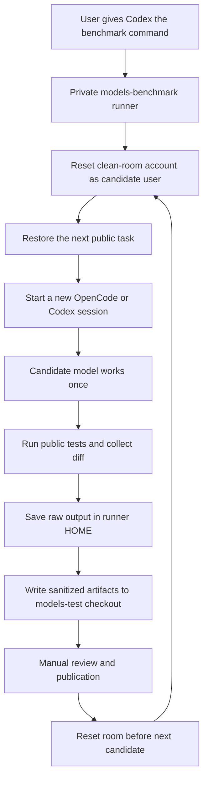

# Models Benchmark

Private research repository for a reproducible, auditable benchmark of coding
models and agent runtimes. It executes the same real software task in a clean
Linux account for every candidate, then preserves code, test evidence, and
independent model reviews as structured data.

The project is being redesigned from the original `models-test` experiment into
a professional benchmark pipeline. The goal is to measure not only whether a
model produces a passing patch, but also correctness, regression safety,
scope discipline, reproducibility, latency, and operational failures.

## Current Status

The clean-room pilot runner, isolated judge workflow, sanitized result format,
and first historical one-task pilot are implemented. The next hardened
two-task release is configured but has not yet invoked models. The pipeline is
still in pilot validation, not a claim of a definitive model ranking.

The current pilot configuration is data-driven: candidate models, judges,
tasks, criteria, subscription labels, and release ID live in
[`config/pilot.json`](config/pilot.json). Their counts can change in later
releases without changing the runner's core workflow.

### Next Pilot Matrix

Release `pilot-2-tasks-r3` contains two tasks, three candidate models, and two
independent judges. Candidate models are invoked through OpenCode with the
subscription label `free`; the judges are GPT and Gemini models, also invoked
through OpenCode:

| Role | ID | Model |
| --- | --- | --- |
| Candidate | `big-pickle` | `opencode/big-pickle` |
| Candidate | `deepseek-v4-flash-free` | `opencode/deepseek-v4-flash-free` |
| Candidate | `mimo-v2-5-free` | `opencode/mimo-v2.5-free` |
| Judge | `gpt-5-4` | `gpt-5.4` (OpenCode provider) |
| Judge | `gemini-3-1-pro` | `gemini-3.1-pro` (OpenCode provider) |

The task, candidate list, judge list, and criteria are release inputs, not
constants. Future releases may add tasks, models, judges, subscription tiers,
or a Codex candidate runtime.

The current tasks are `feature-implementation` and `refactoring`. The former
adds a feature-flag resolution behavior; the latter removes duplicated event
filtering while preserving the public API and malformed-input behavior.

## Design Goals

- identical tasks, prompts, and starting revisions for every candidate;
- isolated execution with no cross-run state or access to private orchestration;
- deterministic, machine-readable artifacts;
- separate model quality from provider availability and infrastructure errors;
- reproducible local runs and independently verifiable published reports;
- explicit versioning of tasks, rubrics, harnesses, models, and runner code.

## Documentation

- [Technical specification](docs/technical-spec.md)
- [Roadmap](docs/roadmap.md)
- [Deployment guide](docs/deployment.md)

The technical specification defines the broader benchmark contract; this README
describes the implemented pilot and how its evidence is stored.

## What Is Tested

This is a coding-agent benchmark, not a generic question-answering benchmark.
Each candidate receives the same public task fixture, task instructions,
documentation, starting Git baseline, and public tests. The current pilot runs
the public `feature-implementation` and `refactoring` tasks from `models-test`.

For every candidate/task pair, the pipeline records:

- whether the agent process completed, timed out, or failed;
- the resulting Git diff and changed-file list;
- the public test result and output;
- agent, test, and combined candidate-execution timings;
- each independent judge's scores, confidence, explanation, and concerns.

The current rubric has four dimensions: functional correctness, reliability
and edge cases, maintainability and clarity, and scope discipline. A passing
public test suite is evidence, not an automatic perfect score.

Judging is identity-blind. Each judge examines an anonymous isolated copy of the
submitted workspace, runs the public tests, and is asked to return structured
scores from 1 to 10 with confidence, explanation, and concerns. The judge
process receives no candidate ID, model, agent/runtime, provider, subscription,
candidate logs, private artifacts, or candidate-derived path. The workspace is
rebuilt from the trusted task baseline and the recorded candidate patch; the
candidate's `.git` directory is never copied, and the judge sandbox can write
only to that anonymous workspace and its fresh agent home. For a completed candidate,
the aggregate averages each criterion across valid judge responses. Its
`overall_average` is the arithmetic mean of all four criterion averages.
Invalid judge output is retained as evidence but excluded from score math;
missing evidence is never converted to zero.

Blind judging hides the declared candidate identity, but it cannot guarantee
that a judge will not infer a model from stylistic or other characteristics of
the submitted code.

## Roles

| Role | Responsibility | Current pilot |
| --- | --- | --- |
| Candidate | Performs the task once in the clean room | Three configured OpenCode models |
| Judge | Independently inspects the resulting workspace and runs public tests | GPT-5.4 and Gemini 3.1 Pro through OpenCode |
| Orchestrator | Starts/reset runs, captures evidence, and reports progress | Codex plus the private runner |

Candidates never see judge prompts, raw judge output from another candidate,
reference solutions, private runner artifacts, or provider credentials. Judges
receive an isolated copy of the completed candidate workspace and start with a
fresh agent home.

## How The Pilot Works

Codex acts as the visible orchestrator. It reads the private runner
configuration, starts the pilot, reports live progress, and stops on an
unexpected failure. Candidate models are executed one at a time in the clean
room through their configured OpenCode or Codex agent.



The next hardened pilot uses two public tasks and three models already present
in the published comparison. Each model receives one pass and one chance per
task. There is no retry and no reuse of a previous agent session.

The pilot clean room is the dedicated Linux account `test`. Its reset script
runs as `test`, removes the workspace and isolated OpenCode/Codex home, then
restores the public task archive owned by that account. The runner invokes the
script before every candidate so a model cannot inherit another model's files
or session history.

The clean room is also reset once after the complete configured matrix. This
means a candidate gets one attempt, a new agent session, and no files or
history from a previous candidate. A rerun is a new benchmark release, never a
retry hidden under the same result directory.

## Repository Boundaries

`models-benchmark` is private and contains the runner, manifests, reset
orchestration, judge configuration, and private raw artifacts. The task itself
and its public tests remain available in `models-test`.

The candidate account can read the published task and tests, but cannot read
runner-owned raw logs, judge prompts, reference solutions, credentials, or
other candidates' results. The runner writes only sanitized result files to
the `models-test` checkout. It never pushes them automatically.

## Outcome Rules

Code quality and operational availability are deliberately different facts.

| Outcome | Meaning | Judge scores |
| --- | --- | --- |
| `completed` | Candidate exited successfully and public tests were evaluated | Included when a judge returns valid structured scores |
| `tests_failed` | Candidate completed but public tests failed | Retained and may be judged |
| `agent_failure` | Provider, process, timeout, or candidate execution failed | Judges are skipped; aggregate score is `N/A` |
| `forbidden_changes` | Candidate changed a path outside the task's `allowed_changes` policy | Patch and test evidence are retained; judges are skipped |

Timeout is additionally recorded as `agent.timed_out: true` in `run.json`. An
unavailable provider must not become a zero-quality row or silently vanish from
a report. It remains visible as an availability result with `N/A` quality data.

## Pilot Commands

From the repository root, inspect the planned matrix first:

```sh
npm run pilot:dry-run
```

The real pilot is intentionally explicit:

```sh
npm run pilot
```

Progress is emitted as newline-delimited JSON. Results are prepared under the
configured `models-test` checkout for manual inspection and publication.

After a pilot, build the local summary without publishing it:

```sh
npm run aggregate -- pilot-1-task-r6
```

The aggregate ignores judge scores for candidates whose agent execution
failed. Such candidates remain visible with an explicit failure outcome.

Each future `run.json` records `started_at`, `completed_at`, and `duration_ms`
for the candidate execution, agent phase, and public-test phase. Judge
artifacts record their execution duration too. Existing artifacts created
before this field was introduced intentionally remain without reconstructed
timing.

## Result Layout

For each candidate and task, the public results directory contains:

```text
run.json
candidate.diff
test-result.json
judges/<judge-id>.json
aggregate.json
aggregate.md
```

The pipeline publishes data only. A separate site or reporting repository may
render it. `run.json` includes candidate, test, and overall execution timing;
`aggregate.json` preserves the same duration data. Reports must render
availability failures as `N/A`, not as zero-quality scores.

`run.json` records the benchmark release, task, agent, runtime, model,
subscription, execution status, changed files, and artifact locations. Raw
agent stdout/stderr remains under the private runner artifact directory.

### Public Artifact Fields

| File | Contents | Publication rule |
| --- | --- | --- |
| `run.json` | Candidate identity, selected agent/runtime, statuses, timestamps, durations, changed files | Sanitized and reviewable |
| `candidate.diff` | Final Git patch against the baseline | Sanitized and reviewable |
| `test-result.json` | Public test exit status, timing, stdout, stderr | Sanitized and reviewable |
| `judges/<id>.json` | Judge identity, scores, confidence, explanation, concerns, timing | Sanitized and reviewable |
| `aggregate.json` / `aggregate.md` | Comparable rows and score averages | Generated locally, manually reviewed |

The runner's own raw stdout/stderr and operational diagnostics stay under
`~/.models-benchmark/runs` owned by the runner account. They are never copied
to the results checkout by the normal workflow.

## Publication Sequence

1. Run the matrix once for a new release identifier.
2. Generate the aggregate data.
3. Inspect the sanitized result directory and verify that no private paths,
   prompts, logs, hidden data, or secrets entered it.
4. Commit and push the results only in a separate manual action.
5. Let a site or other reporting layer consume the published JSON/Markdown.

The private pipeline generates data only. It does not build HTML and does not
publish a website. Presentation must not alter, replace, or conceal the raw
sanitized evidence.

## Pilot Limits

- Two public tasks cannot establish a general model ranking.
- A candidate gets one attempt; provider availability is measured separately
  from patch quality.
- Tasks and public tests are visible to candidates by design. Private prompts,
  raw logs, reference solutions, and credentials are not.
- The pilot currently measures execution time, not token cost or price.
- Results require manual review before publication; a successful local run is
  not automatically a public benchmark release.

## Security Boundary

Candidate models run in transient systemd mount namespaces with private `/tmp`,
a read-only OpenCode runtime, and writable binds only for the disposable
workspace and agent home. Tasks and public tests are intentionally available to
the candidate. Reference solutions, judge prompts, scoring data, secrets,
provider tokens, and private repository contents must never be available to the
candidate process or published in the public results repository.

Candidate, test, and judge stdout/stderr are capped at 2 MiB per stream by
default. Exceeding the cap terminates the process and records an execution
failure, preventing unbounded runner-memory use. The task's `allowed_changes`
policy is enforced before judging, so a model cannot obtain a completed result
by changing tests or package metadata.
