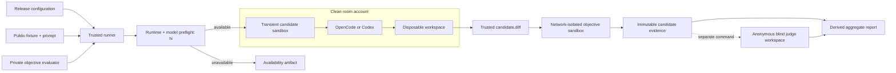

# Models Benchmark

<p align="center"><strong>Reproducible coding-agent evaluation in an isolated clean room</strong></p>

[](#requirements)
[](#requirements)
[](#agent-runtimes)
[](LICENSE)

> [!NOTE]
> This is an independent open-source benchmark created and maintained by an individual developer for personal purposes and shared with the public. It is not an official test suite from OpenAI, OpenCode, or any model provider. Anyone can use it, run tests, and share it.
>
> Results produced by this benchmark are published on the [interactive benchmark website](https://pickleshell.github.io/model-benchmarks.html) and in the [models-test repository](https://github.com/pickleshell/models-test), which contains the public fixtures, patches, execution records, and sanitized results.

*From a discussion about the benchmark on Reddit.*

> **RogerAI-fm asked:**
>
> I think I get this. Anyone can use these? Could you talk more about what it’s meant for?
>
> **Answer:**
>
> Sure. It runs different coding models on the same real repository tasks and compares the results, time, and cost.
>
> At the moment, I use this pipeline in autonomous mode. I give Codex a list of models I want to test. It verifies them with a simple `hi` prompt to make sure they are accessible, then starts the test runs and manages them in the background if the list is long.
>
> When testing is complete, I ask Codex to review the results using several parameters. The judging can also be done by several independent judges. There is a separate list for them.
>
> You can test your own models, reproduce my results, or add new tasks. For example, select five models and test them on several repository tasks. Then you can see which model performs better and which one is cheaper. Everything is open.
>
> Honestly, I originally created this benchmark for my own purposes in a much simpler form. The results surprised me, so I posted them in the OpenCode community on Reddit. I received useful feedback about blind testing, improved the pipeline, and added clean rooms so models could not cheat.
>
> That was already more than I needed for my personal purposes, but I remembered how Big Pickle once cheated me, so I took these security recommendations seriously.
>
> After that, I searched for other model comparisons and was surprised that I could not find honest and fully open tests of this kind. That gave me one more reason to continue developing the benchmark.
>
> At this point, probably 50% of the project grows from Reddit feedback, including yours. When I finish this comment, I will add a section to the README with the same explanation.
>
> As for me, I am an experienced software engineer. I love computers and my work, and I want to see progress faster because life is too short.
>
> **PS:** These tests have already cost me more than $40 in paid-model usage. That is why there is usually only one judge. Gemini was good enough and produced scores very close to GPT. Claude was expensive, missed model faults several times, and was disqualified. So I thanked Gemini for its good work and continued with GPT only. GPT-only results are sufficient for my own purposes.
>
> I hope it helps. Have a nice time!

Models Benchmark compares coding models on the same repository tasks under the
same execution contract. Each candidate receives a clean workspace, a fresh
agent home, the same prompt and public tests, and one immutable attempt. The
runner records the resulting patch, objective result, duration, and
provider-reported solution cost without mixing candidate execution with model
judging.

The project answers a practical question: **what did a coding model actually
deliver when asked to modify a real repository?** Availability failures,
infrastructure failures, test failures, forbidden changes, and code quality are
kept separate so a provider outage is not presented as a bad solution.

This repository contains orchestration, private evaluators, and raw
runner artifacts. Public fixtures and sanitized results live in the adjacent
`models-test` checkout.

> [!WARNING]
> A real benchmark run contacts model providers, consumes quota, and creates
> immutable evidence. Always run the dry-run and inspect the selected release
> configuration first. Never use a real candidate run as a health check.

## What the benchmark provides

- data-driven candidate, task, evaluator, and judge manifests;
- sequential OpenCode and Codex candidate execution;
- a harmless `hi` availability probe before task assignment;
- a fresh workspace and agent home for every attempt;
- transient systemd mount, IPC, process, device, and filesystem isolation;
- trusted baseline comparison that captures tracked, untracked, and committed changes;
- explicit allowed-path enforcement;
- public tests plus a separate private objective evaluator;
- immutable, schema-versioned, hash-verified artifacts;
- candidate duration and provider-reported solution cost;
- candidate testing and identity-blind judging as separate stages;
- derived JSON and Markdown aggregate reports.

## Quick start

The complete host setup is documented in
[`docs/deployment.md`](docs/deployment.md). On an already provisioned benchmark
host:

```bash
cd /home/gpt/models-benchmark

# Validate the runner without contacting a model.
npm test
npm run verify:sandbox
npm run verify:objective-sandbox

# Inspect the configured matrix without consuming quota.
npm run pilot:dry-run

# Run candidate availability checks, patches, and objective tests only.
npm run pilot

# Generate derived reports for the configured release.
npm run aggregate
```

To use another immutable release configuration:

```bash
BENCHMARK_CONFIG=config/example-release.json npm run pilot -- --dry-run
BENCHMARK_CONFIG=config/example-release.json npm run pilot
BENCHMARK_CONFIG=config/example-release.json npm run aggregate
```

Judging is deliberately separate:

```bash
BENCHMARK_CONFIG=config/example-release.json \
  npm run pilot:judges -- --judge <judge-id>
```

See [`docs/benchmark-workflow.md`](docs/benchmark-workflow.md) before creating
or executing a release.

## Architecture



The trusted runner owns release configuration, private evaluators, raw logs,
and result capture. Candidates execute as the unprivileged `test` account.
Objective evaluation uses a separate sandbox with no model runtime,
credentials, agent home, or network. Judges receive a reconstructed anonymous
workspace, not the candidate workspace or identity.

## Benchmark lifecycle

1. Define a new release ID and freeze its full candidate and nomination roster.
2. Select a nomination and optional candidate subset without changing the frozen release.
3. Verify runtime versions and clean-room ownership.
4. Reset the workspace and agent home.
5. Ask the candidate to reply to `hi`; record unavailable models without assigning the task.
6. Run each available candidate sequentially in a fresh sandbox.
7. Capture the patch against a trusted baseline and enforce `allowed_changes`.
8. Run public tests and the private deterministic evaluator independently.
9. Freeze candidate evidence, timing, and known solution cost.
10. Optionally run identity-blind judging through a separate explicit command.
11. Generate derived aggregate files and review them before publication.
12. Validate website tables against [`docs/table-formats.md`](docs/table-formats.md),
    including column order, human-readable statuses, units, and deployed DOM.

An attempt is append-only. `--resume` verifies and skips compatible completed
artifacts; it does not overwrite them. A corrected prompt, evaluator, runtime
contract, or invalid infrastructure attempt requires a new release ID.

## Agent runtimes

### OpenCode

OpenCode candidates use the read-only runtime configured by
`clean_room.opencode_root`. Provider credentials are copied into the disposable
agent home when configured. OpenCode JSON events provide token telemetry and,
when the provider reports it, task solution cost.

### Codex

Codex candidates use the read-only native runtime configured by
`clean_room.codex_root`. A complete runtime contains:

```text
bin/codex
bin/codex-code-mode-host
codex-path/rg
codex-resources/bwrap
codex-package.json
```

The runner fails before contacting a model if any component is missing. Only
`auth.json` is copied to the fresh `CODEX_HOME`; user configuration, history,
memories, rules, plugins, and sessions are excluded. Codex runs in ephemeral
JSON mode with its internal approval sandbox disabled because the outer
systemd clean room is the authoritative boundary.

Codex CLI currently does not report a monetary task cost in the event stream.
Its `cost_usd` is therefore `null`/`N/A`, never estimated.

## Isolation model

Every candidate command, public test, judge, and candidate-workspace Git
inspection runs in a fresh transient systemd unit. Important controls include:

- `ProtectHome=tmpfs` and `ProtectSystem=strict`;
- `PrivateTmp=yes`, `PrivateIPC=yes`, and a private `/dev/shm`;
- `ProtectProc=invisible`, `PrivateDevices=yes`, and `NoNewPrivileges=yes`;
- namespace, kernel, control-group, and SUID/SGID restrictions;
- read-only runtime binds;
- writable binds limited to the current workspace and fresh agent home;
- complete unit termination on timeout or output-limit failure;
- a host-wide clean-room lock and an idle-account check.

The objective evaluator is stricter: it receives one disposable workspace,
the immutable patch, evaluator code, and public source file; it has no network
and no candidate runtime or credentials.

This is strong process and mount isolation, not a defense against a compromised
kernel or host administrator. Candidate runtimes retain outbound access to
their model providers. See the security contract in
[`docs/technical-spec.md`](docs/technical-spec.md).

## Configuration

Release configurations live in [`config/`](config/). The important fields are:

| Field | Purpose |
| --- | --- |
| `release` | Immutable release identifier |
| `models_test` | Public fixture and sanitized-result checkout |
| `results_dir` | Result directory relative to `models_test` |
| `private_artifacts_dir` | Runner-owned raw logs and diagnostics |
| `private_evaluators_dir` | Trusted private evaluator root |
| `clean_room` | Account, workspace, runtime, auth, and lock paths |
| `nominations` | Fixtures, prompts, tests, allowed paths, and evaluator references |
| `candidates` | Candidate ID, runtime/agent, model, provider metadata, and variant |
| `judges` | Optional models available only to the separate judging stage |
| `criteria` | Manual and model-review rubric dimensions |

A minimal candidate entry is:

```json
{
  "id": "example-model",
  "agent": "opencode",
  "model": "provider/example-model",
  "reasoning_variant": "provider_default"
}
```

For Codex, set `"agent": "codex"` and use the Codex model identifier. Full
field semantics and release rules are in
[`docs/benchmark-workflow.md`](docs/benchmark-workflow.md).

## Selecting work

Selectors accept repeated values or comma-separated IDs:

```bash
node scripts/run-pilot.mjs --phase candidates \
  --candidate model-a,model-b \
  --nomination patch

node scripts/run-pilot.mjs --phase judges \
  --candidate model-a \
  --nomination patch \
  --judge judge-a \
  --resume
```

`--nomination` is canonical. `--task` exists only as a deprecated compatibility
alias. Candidate execution remains sequential even when several candidates are
selected.

## Outcomes

| Outcome | Meaning |
| --- | --- |
| `completed` | Candidate process and public tests completed successfully |
| `unavailable` | The model did not produce a valid response to `hi` |
| `agent_failure` | Candidate process failed, timed out, or exceeded output limits |
| `tests_failed` | Candidate completed, but public tests failed |
| `forbidden_changes` | Patch modified a path outside the nomination allowlist |
| `missing_artifacts` | Required immutable evidence is absent or incompatible |

`completed` does not imply objective correctness. Public tests and the private
evaluator are reported independently. A model may pass public tests while
failing hidden edge cases.

## Timing and cost

`run.json` records:

- total task duration;
- model execution duration;
- public-test duration;
- provider-reported candidate solution cost;
- whether preflight or judging is included.

The displayed task price excludes availability preflight, judges, fallbacks,
and manual review. Unknown cost remains `null`. It is never reconstructed from
tokens, published prices, time, or another model's telemetry.

## Testing and judging are separate

`npm run pilot` performs only candidate availability checks, candidate work,
public tests, and objective evaluation. It does not contact a judge.

Judging uses `--phase judges` after candidate evidence is frozen. Each judge
receives only the trusted public task, rubric, submitted code, and explicitly
allowlisted test status. Candidate identity, model, runtime, provider,
subscription, logs, private paths, and hidden evaluator results are excluded.

Manual reviews may be stored beside an attempt under
`manual-reviews/<reviewer>.json`. They are annotations and do not mutate the
candidate run.

## Artifacts

Sanitized public output is written under:

```text
<models_test>/<results_dir>/<release>/
├── manifest.json
├── aggregate.json
├── aggregate.md
└── <candidate>/<nomination>/attempts/attempt-1/
    ├── run.json
    ├── candidate.diff
    ├── test-result.json
    ├── objective-evaluator.json
    ├── judges/
    └── manual-reviews/
```

Raw stdout and stderr remain under the runner-owned
`private_artifacts_dir/<release>/` and must never be published. Aggregate files
are derived and may be regenerated; primary attempt artifacts are immutable.

## Requirements

- Linux with systemd;
- Node.js 20 or newer;
- Git and `rsync`;
- `sudo` access for the trusted runner account;
- a dedicated unprivileged clean-room account;
- an installed OpenCode runtime, Codex runtime, or both;
- a local checkout of `models-test`;
- provider access for the selected candidates.

## Development

Required checks for code and documentation changes:

```bash
npm test
npm run pilot:dry-run
git diff --check
```

For deployment or isolation changes, also run:

```bash
npm run verify:sandbox
npm run verify:objective-sandbox
```

These verification commands do not invoke candidate models. A real
`npm run pilot` is never part of a generic development check.

## Documentation

- [Benchmark workflow](docs/benchmark-workflow.md) — releases, execution, artifacts, and interpretation
- [Deployment guide](docs/deployment.md) — accounts, runtimes, credentials, sudo, and verification
- [Technical specification](docs/technical-spec.md) — formal architecture and security contract
- [Roadmap](docs/roadmap.md) — completed phases and remaining work
- [Contributor guide](AGENTS.md) — repository-specific engineering rules

## Limitations

- Results describe the tested task, runtime, model identifier, provider route,
  release inputs, and attempt—not a universal model ranking.
- Provider availability can change between releases.
- OpenCode and Codex are distinct runtimes even when model names look similar.
- Hidden evaluators improve edge-case coverage but cannot prove all behavior.
- Identity-blind judging removes explicit identity, not stylistic inference.
- Network egress to model providers remains available.
- Publication is manual; the runner never commits or pushes `models-test`.

## Contact

Open a GitHub issue to report a bug, suggest an improvement, or ask for help.

- [Create an issue](https://github.com/pickleshell/models-benchmark/issues/new)
- [Browse existing issues](https://github.com/pickleshell/models-benchmark/issues)
- Email: [pickleshell.plugin@gmail.com](mailto:pickleshell.plugin@gmail.com)

## License

Models Benchmark is available under the [MIT License](LICENSE).
