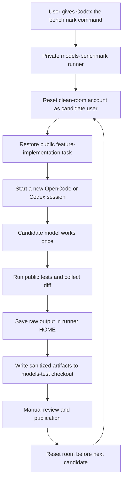

# Models Benchmark

Private research repository for a reproducible, auditable benchmark of coding
models and agent runtimes.

The project is being redesigned from the original `models-test` experiment into
a professional benchmark pipeline. The goal is to measure not only whether a
model produces a passing patch, but also correctness, regression safety,
scope discipline, reproducibility, latency, and operational failures.

## Current Status

The clean-room pilot runner, isolated judge workflow, sanitized result format,
and first one-task pilot are implemented. The pipeline is still in pilot
validation, not a claim of a definitive model ranking.

## Design Goals

- identical tasks, prompts, and starting revisions for every candidate;
- isolated execution with no cross-run state or access to private orchestration;
- deterministic, machine-readable artifacts;
- separate model quality from provider availability and infrastructure errors;
- reproducible local runs and independently verifiable published reports;
- explicit versioning of tasks, rubrics, harnesses, models, and runner code.

## Documentation

- [Technical specification](docs/technical-spec.md)
- [Roadmap](docs/roadmap.md)
- [Deployment guide](docs/deployment.md)

The specification is intentionally open for review before implementation.

## How The Pilot Works

Codex acts as the visible orchestrator. It reads the private runner
configuration, starts the pilot, reports live progress, and stops on an
unexpected failure. Candidate models are executed one at a time in the clean
room through their configured OpenCode or Codex agent.



The first pilot uses one public task and three models already present in the
published comparison. Each model receives one pass and one chance. There is
no retry and no reuse of a previous agent session.

The pilot clean room is the dedicated Linux account `test`. Its reset script
runs as `test`, removes the workspace and isolated OpenCode/Codex home, then
restores the public task archive owned by that account. The runner invokes the
script before every candidate so a model cannot inherit another model's files
or session history.

## Repository Boundaries

`models-benchmark` is private and contains the runner, manifests, reset
orchestration, judge configuration, and private raw artifacts. The task itself
and its public tests remain available in `models-test`.

The candidate account can read the published task and tests, but cannot read
runner-owned raw logs, judge prompts, reference solutions, credentials, or
other candidates' results. The runner writes only sanitized result files to
the `models-test` checkout. It never pushes them automatically.

## Pilot Commands

From the repository root, inspect the planned matrix first:

```sh
npm run pilot:dry-run
```

The real pilot is intentionally explicit:

```sh
npm run pilot
```

Progress is emitted as newline-delimited JSON. Results are prepared under the
configured `models-test` checkout for manual inspection and publication.

After a pilot, build the local summary without publishing it:

```sh
npm run aggregate -- pilot-1-task-r6
```

The aggregate ignores judge scores for candidates whose agent execution
failed. Such candidates remain visible with an explicit failure outcome.

Each future `run.json` records `started_at`, `completed_at`, and `duration_ms`
for the candidate execution, agent phase, and public-test phase. Judge
artifacts record their execution duration too. Existing artifacts created
before this field was introduced intentionally remain without reconstructed
timing.

## Result Layout

For each candidate and task, the public results directory contains:

```text
run.json
candidate.diff
test-result.json
judges/<judge-id>.json
aggregate.json
aggregate.md
```

The pipeline publishes data only. A separate site or reporting repository may
render it. `run.json` includes candidate, test, and overall execution timing;
`aggregate.json` preserves the same duration data. Reports must render
availability failures as `N/A`, not as zero-quality scores.

`run.json` records the benchmark release, task, agent, runtime, model,
subscription, execution status, changed files, and artifact locations. Raw
agent stdout/stderr remains under the private runner artifact directory.

## Security Boundary

Candidate models run against disposable workspaces with least-privilege
credentials. Tasks and public tests are intentionally available to the
candidate. Reference solutions, judge prompts, scoring data, secrets, provider
tokens, and private repository contents must never be available to the
candidate process or published in the public results repository.
